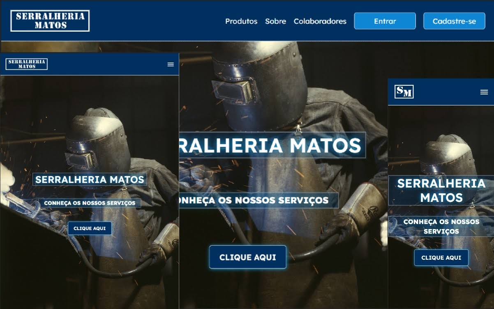

    
    <h2>Desenvolvimento de um sistema web para ampliar a visibilidade, e otimizar as finanças da Serralheria Matos</h2>

    

    <h4>🔗Link da Aplicação Web</h4>
    <a href="https://www.serralheriamatos.site/" target="_blank">https://www.serralheriamatos.site/</a>

    <h4>📝Sobre</h4>
    
Com este aplicativo web o cliente poderá adquirir os produtos e serviços da Serralheria Matos, sem a necessidade de se deslocar até a mesma. Outra funcionalidade é que os clientes poderam montar o seu produto/serviço personalizado através de um formulário, que conterá upload de imagens e demais campos como nome do produto, descrição e quantidade. O cliente terá um suporte no site para auxiliá-los eventuais dúvidas que sugirem durante a navegação na plataforma. O sistema web é adaptável aos principais dipositivos móveis (celulares, tablets e notebooks) e computadores.

    <h4>🔨 Ferramentas usadas</h4>
    <ul style="list-style: none; display: flex; flex-direction: column; gap: 7px;">
        <li style="display: flex; gap: 5px; align-items: center">
            
            <a href="https://reactjs.org/" target="_blank" style="color: #61dafb; text-decoration: none;">
                ReactJS
            </a>
        </li>
        <li style="display: flex; gap: 5px; align-items: center">
            
            <a href="https://nodejs.org/" target="_blank" style="color: #026e00; text-decoration: none;">
                NodeJS
            </a>
        </li>
        <li style="display: flex; gap: 5px; align-items: center">
            
            <a href="https://www.postgresql.org/" target="_blank" style="color: #699eca; text-decoration: none;">
                PostgreSQL
            </a>
        </li>
        <li style="display: flex; gap: 5px; align-items: center">
            
            <a href="https://firebase.google.com/" target="_blank" style="color: #f57d01; text-decoration: none;">
                Firebase
            </a>
        </li>
        <li style="display: flex; gap: 5px; align-items: center">
            
            <a href="https://getbootstrap.com/" target="_blank" style="color: #6f42c1; text-decoration: none;">
                Bootstrap
            </a>
        </li>
    </ul>

    <h4>📱 Créditos</h4>
    <ul style="list-style: none; display: flex; flex-direction: column; gap: 7px;">
        <li>
            <a href="https://www.flaticon.com/br/icones-gratis/nodejs" title="nodejs ícones">Nodejs ícones criados por Freepik - Flaticon</a>
        </li>
        <li>
            <a href="https://www.flaticon.com/free-icons/react" title="react icons">React icons created by Kiranshastry - Flaticon</a>
        </li>
        <li>
            <a href="https://www.flaticon.com/br/icones-gratis/postgre" title="postgre ícones">Postgre ícones criados por Freepik - Flaticon</a>
        </li>
        <li>
            <a href="https://www.flaticon.com/br/icones-gratis/bootstrap" title="bootstrap ícones">Bootstrap ícones criados por Freepik - Flaticon</a>
        </li>
    </ul>

